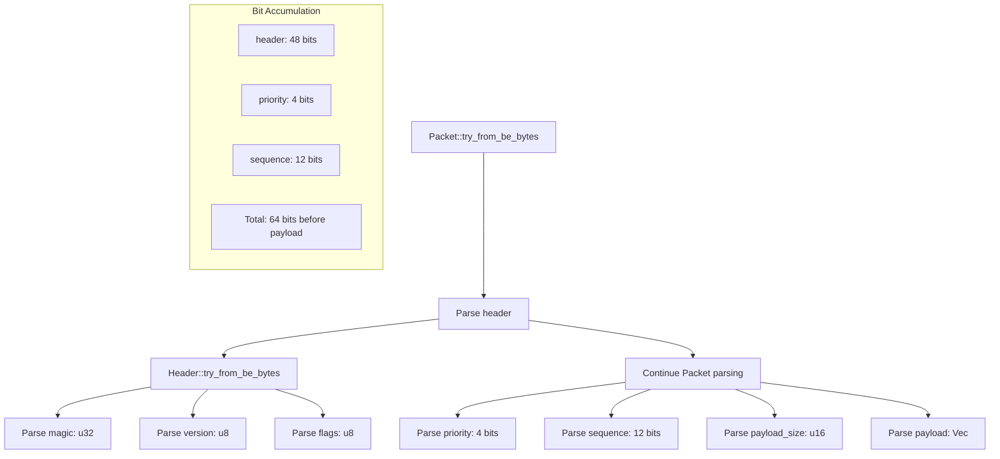

# BeBytes Code Generation Examples

Examples of BeBytes macro code generation.

## Basic Struct Example

### Input
```rust
#[derive(BeBytes)]
struct Simple {
    version: u8,
    length: u16,
    data: u32,
}
```

### Generated Code
```rust
impl BeBytes for Simple {
    fn field_size() -> usize {
        let mut bit_sum = 0;
        bit_sum += 8;  // version: u8
        bit_sum += 16; // length: u16
        bit_sum += 32; // data: u32
        bit_sum / 8    // Total: 7 bytes
    }

    fn try_from_be_bytes(bytes: &[u8]) -> Result<(Self, usize), BeBytesError> {
        if bytes.is_empty() {
            return Err(BeBytesError::EmptyBuffer);
        }

        let mut _bit_sum = 0;
        let mut byte_index = 0;
        let mut end_byte_index = 0;
        let buffer_size = bytes.len();

        // Parse version
        if byte_index + 1 > buffer_size {
            return Err(BeBytesError::InsufficientBytes);
        }
        let version = u8::from_be_bytes([bytes[byte_index]]);
        _bit_sum += 8;
        byte_index = usize::div_ceil(_bit_sum, 8);

        // Parse length
        if byte_index + 2 > buffer_size {
            return Err(BeBytesError::InsufficientBytes);
        }
        let length = u16::from_be_bytes([bytes[byte_index], bytes[byte_index + 1]]);
        _bit_sum += 16;
        byte_index = usize::div_ceil(_bit_sum, 8);

        // Parse data
        if byte_index + 4 > buffer_size {
            return Err(BeBytesError::InsufficientBytes);
        }
        let data = u32::from_be_bytes([
            bytes[byte_index],
            bytes[byte_index + 1],
            bytes[byte_index + 2],
            bytes[byte_index + 3],
        ]);
        _bit_sum += 32;

        Ok((Self { version, length, data }, usize::div_ceil(_bit_sum, 8)))
    }

    fn to_be_bytes(&self) -> Vec<u8> {
        let capacity = Self::field_size();
        let mut bytes = Vec::with_capacity(capacity);
        let mut _bit_sum = 0;

        // Write version
        bytes.extend_from_slice(&self.version.to_be_bytes());
        _bit_sum += 8;

        // Write length
        bytes.extend_from_slice(&self.length.to_be_bytes());
        _bit_sum += 16;

        // Write data
        bytes.extend_from_slice(&self.data.to_be_bytes());
        _bit_sum += 32;

        bytes
    }

    // Similar implementations for try_from_le_bytes and to_le_bytes
    // using from_le_bytes and to_le_bytes instead
}
```

## Bit Fields Example

### Input
```rust
#[derive(BeBytes)]
struct BitPacked {
    #[bits(1)]
    flag: u8,
    #[bits(3)]
    mode: u8,
    #[bits(4)]
    priority: u8,
    value: u16,
}
```

### Generated Code
```rust
impl BeBytes for BitPacked {
    fn field_size() -> usize {
        let mut bit_sum = 0;
        bit_sum += 1;  // flag
        bit_sum += 3;  // mode
        bit_sum += 4;  // priority
        bit_sum += 16; // value
        bit_sum / 8    // Total: 3 bytes
    }

    fn try_from_be_bytes(bytes: &[u8]) -> Result<(Self, usize), BeBytesError> {
        // ... buffer checks ...

        // Parse bit fields from first byte
        let flag = (bytes[0] >> 7) & 0x01;
        _bit_sum += 1;

        let mode = (bytes[0] >> 4) & 0x07;
        _bit_sum += 3;

        let priority = bytes[0] & 0x0F;
        _bit_sum += 4;

        byte_index = 1; // Move to next byte

        // Parse value (regular field)
        let value = u16::from_be_bytes([bytes[1], bytes[2]]);
        _bit_sum += 16;

        Ok((Self { flag, mode, priority, value }, 3))
    }

    fn to_be_bytes(&self) -> Vec<u8> {
        let mut bytes = Vec::with_capacity(3);
        let mut _bit_sum = 0;

        // Bit fields are accumulated in a byte
        let mut current_byte = 0u8;

        // Write flag (1 bit)
        current_byte |= (self.flag & 0x01) << 7;
        _bit_sum += 1;

        // Write mode (3 bits)
        current_byte |= (self.mode & 0x07) << 4;
        _bit_sum += 3;

        // Write priority (4 bits)
        current_byte |= self.priority & 0x0F;
        _bit_sum += 4;

        bytes.push(current_byte);

        // Write value
        bytes.extend_from_slice(&self.value.to_be_bytes());

        bytes
    }
}

impl BitPacked {
    pub fn new(flag: u8, mode: u8, priority: u8, value: u16) -> Self {
        // Field limit checks
        assert!(flag <= 1, "flag exceeds 1-bit limit");
        assert!(mode <= 7, "mode exceeds 3-bit limit");
        assert!(priority <= 15, "priority exceeds 4-bit limit");
        Self { flag, mode, priority, value }
    }
}
```

## Multi-Byte Bit Fields

### Input
```rust
#[derive(BeBytes)]
struct CrossByteBits {
    #[bits(12)]
    id: u16,
    #[bits(20)]
    timestamp: u32,
}
```

### Generated Code (Parsing)
```rust
// For 12-bit id field spanning 2 bytes
let mut id = 0u16;
if _bit_sum % 8 != 0 && _bit_sum / 8 < (_bit_sum + 12) / 8 {
    // Field crosses byte boundary
    let bits_in_current_byte = 8 - (_bit_sum % 8);
    let mask = (1u16 << bits_in_current_byte) - 1;
    id = (bytes[byte_index] & mask as u8) as u16;
    
    byte_index += 1;
    let remaining_bits = 12 - bits_in_current_byte;
    let shift = 8 - remaining_bits;
    id = (id << remaining_bits) | ((bytes[byte_index] >> shift) as u16);
} else {
    // Field within single byte (not applicable for 12 bits)
}
_bit_sum += 12;
```

## Vector with Dynamic Size

### Input
```rust
#[derive(BeBytes)]
struct Dynamic {
    header: u32,
    count: u16,
    #[FromField(count)]
    items: Vec<u8>,
    checksum: u32,
}
```

### Generated Code
```rust
// Parsing
let count = u16::from_be_bytes([bytes[4], bytes[5]]);
_bit_sum += 16;
byte_index = 6;

// Dynamic vector parsing
end_byte_index = byte_index + count as usize;
if end_byte_index > buffer_size {
    return Err(BeBytesError::InsufficientBytes);
}
let items = bytes[byte_index..end_byte_index].to_vec();
_bit_sum += (count as usize) * 8;
byte_index = end_byte_index;

// Continue with checksum...

// Writing
bytes.extend_from_slice(&self.count.to_be_bytes());
bytes.extend_from_slice(&self.items);
```

## Enum Example

### Input
```rust
#[derive(BeBytes)]
#[repr(u8)]
enum Status {
    Idle = 0,
    Running = 1,
    Error = 2,
}

#[derive(BeBytes)]
struct WithEnum {
    #[bits(2)]
    status: Status,
    #[bits(6)]
    flags: u8,
}
```

### Generated Code (For Enum)
```rust
impl BeBytes for Status {
    fn field_size() -> usize {
        1
    }

    fn try_from_be_bytes(bytes: &[u8]) -> Result<(Self, usize), BeBytesError> {
        if bytes.is_empty() {
            return Err(BeBytesError::EmptyBuffer);
        }
        
        match bytes[0] {
            0 => Ok((Status::Idle, 1)),
            1 => Ok((Status::Running, 1)),
            2 => Ok((Status::Error, 1)),
            _ => Err(BeBytesError::InvalidEnumValue),
        }
    }

    fn to_be_bytes(&self) -> Vec<u8> {
        vec![*self as u8]
    }
}

impl TryFrom<u8> for Status {
    type Error = BeBytesError;
    
    fn try_from(value: u8) -> Result<Self, Self::Error> {
        match value {
            0 => Ok(Status::Idle),
            1 => Ok(Status::Running),
            2 => Ok(Status::Error),
            _ => Err(BeBytesError::InvalidEnumValue),
        }
    }
}
```

## Flag Enum Example

### Input
```rust
#[derive(BeBytes)]
#[bebytes(flags)]
#[repr(u8)]
enum Permissions {
    None = 0,
    Read = 1,
    Write = 2,
    Execute = 4,
}
```

### Generated Code (Additional Implementations)
```rust
impl std::ops::BitOr for Permissions {
    type Output = u8;
    
    fn bitor(self, rhs: Self) -> Self::Output {
        self as u8 | rhs as u8
    }
}

impl std::ops::BitOr<u8> for Permissions {
    type Output = u8;
    
    fn bitor(self, rhs: u8) -> Self::Output {
        self as u8 | rhs
    }
}

impl Permissions {
    pub fn contains(&self, flag: Self) -> bool {
        (*self as u8) & (flag as u8) != 0
    }
    
    pub fn from_bits(bits: u8) -> Option<u8> {
        // Validate all bits are valid flags
        let valid_mask = 0 | 1 | 2 | 4; // All valid discriminants OR'd
        if bits & !valid_mask == 0 {
            Some(bits)
        } else {
            None
        }
    }
}
```

## Complex Nested Structure

### Input
```rust
#[derive(BeBytes)]
struct Header {
    magic: u32,
    version: u8,
    flags: u8,
}

#[derive(BeBytes)]
struct Packet {
    header: Header,
    #[bits(4)]
    priority: u8,
    #[bits(12)]
    sequence: u16,
    payload_size: u16,
    #[FromField(payload_size)]
    payload: Vec<u8>,
}
```

### Generated Code Structure


## Error Handling Patterns

### Buffer Validation
```rust
// Generated for each field
if byte_index + size_needed > buffer_size {
    return Err(BeBytesError::InsufficientBytes);
}
```

### Enum Validation
```rust
// For regular enums
match discriminant {
    0 => Ok(MyEnum::Variant1),
    1 => Ok(MyEnum::Variant2),
    _ => Err(BeBytesError::InvalidEnumValue),
}
```

### Compile-Time Validation
```rust
// In generated new() method
assert!(
    self.field <= (1 << bits) - 1,
    concat!("field exceeds ", stringify!(bits), "-bit limit")
);
```

## Optimization Patterns

### Capacity Pre-allocation
```rust
fn to_be_bytes(&self) -> Vec<u8> {
    let capacity = Self::field_size();
    let mut bytes = Vec::with_capacity(capacity);
    // ... writing logic ...
}
```

### Minimal Copying
```rust
// For arrays - direct slice extension
bytes.extend_from_slice(&self.array_field);

// For vectors with known size - direct extension
bytes.extend_from_slice(&self.vec_field);
```

### Bit Packing Efficiency
```rust
// Multiple bit fields in same byte are combined
let packed_byte = (field1 << 6) | (field2 << 3) | field3;
bytes.push(packed_byte);
```

