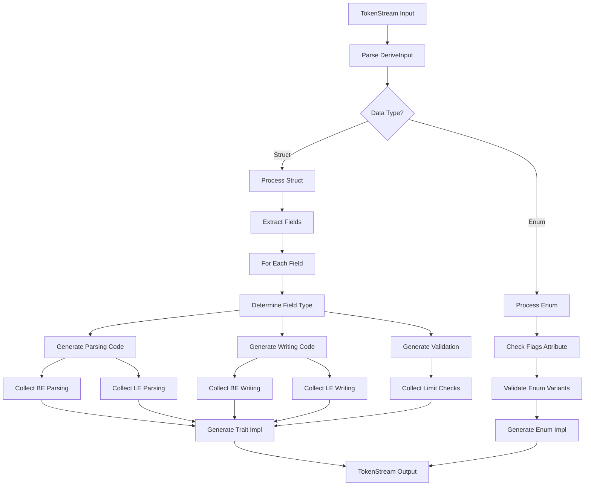
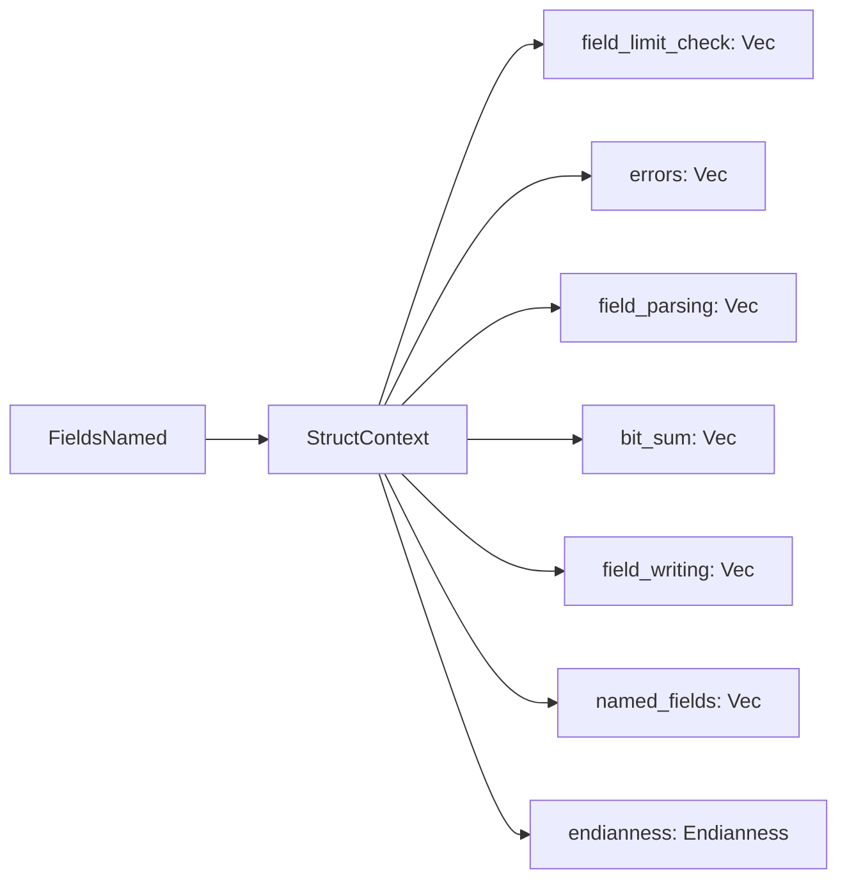
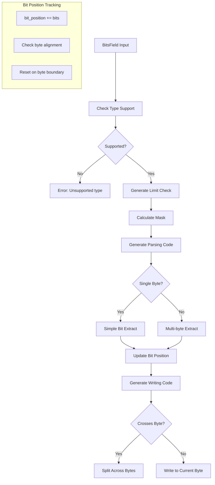
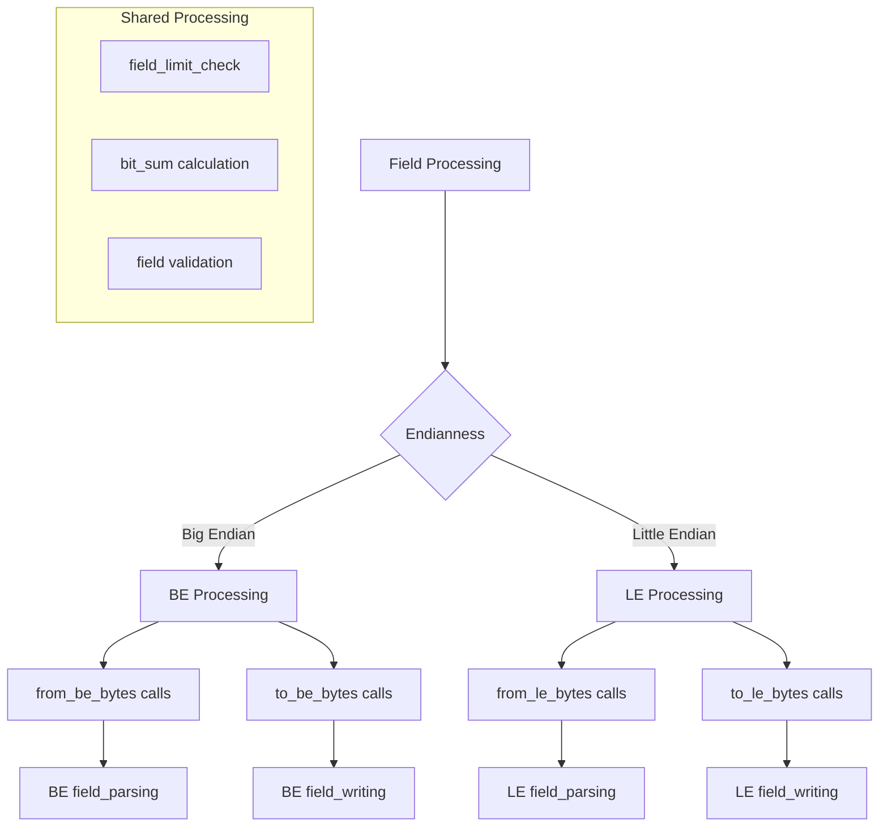
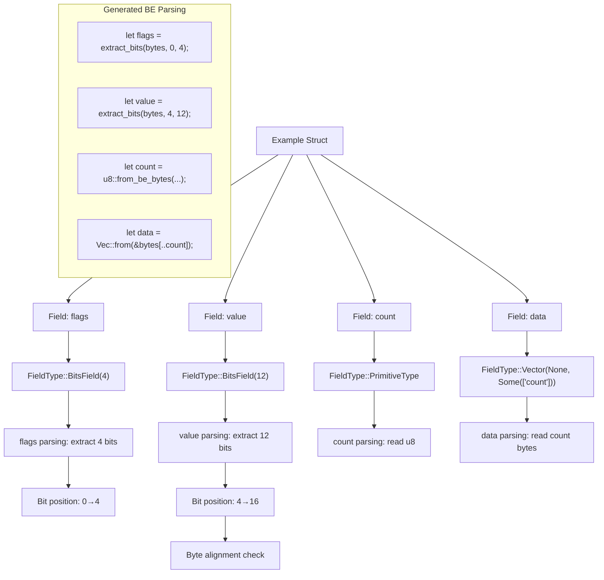
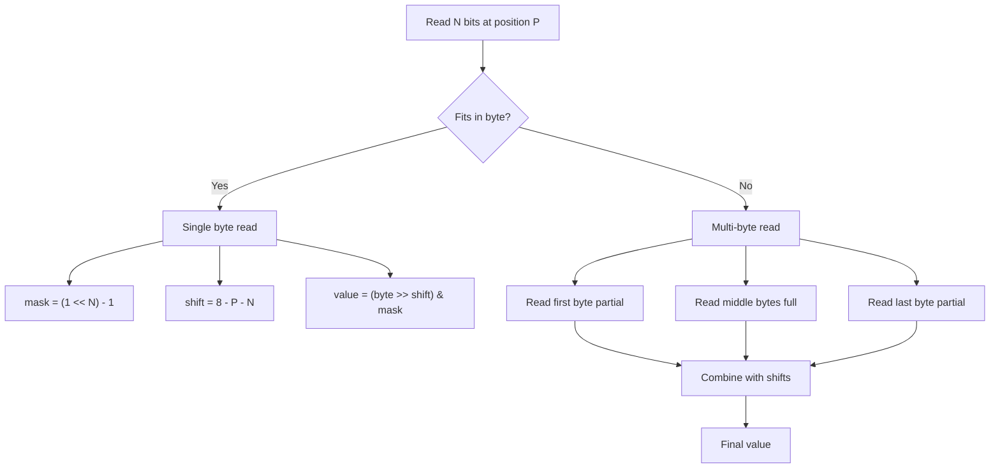
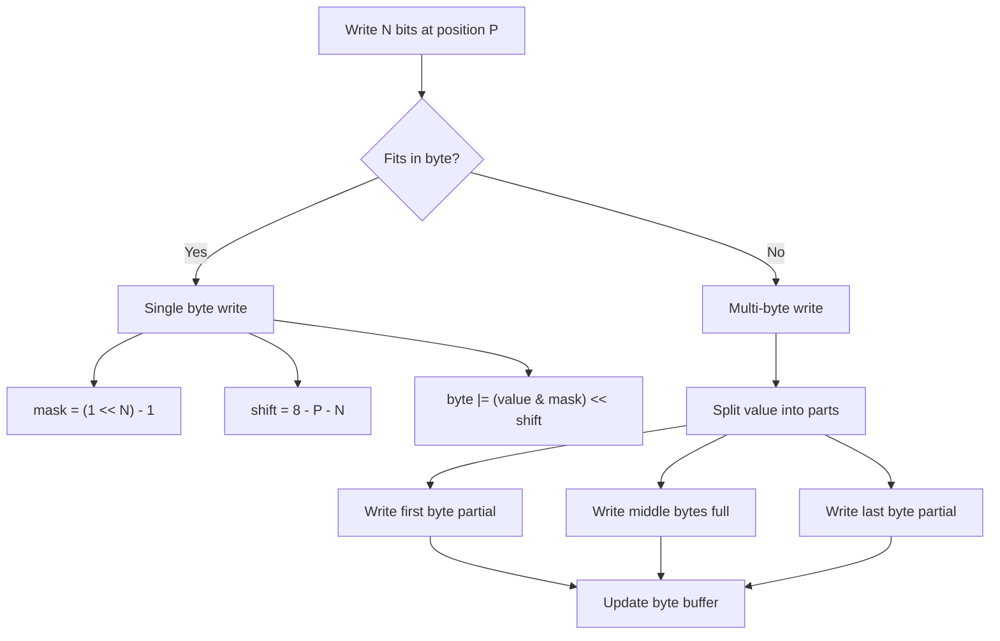
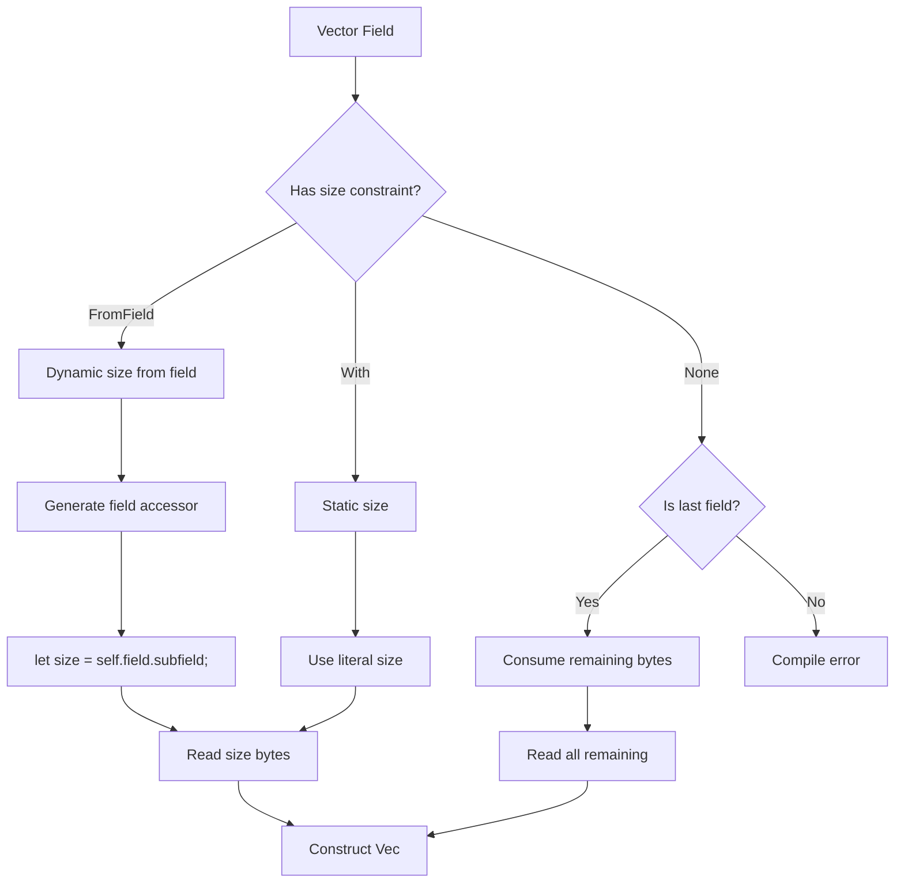

# BeBytes Macro Data Flow

Data flow through the BeBytes derive macro.

## Overview




## Struct Processing Pipeline

### 1. Initial Data Collection



### 2. Field Type Determination

```mermaid
flowchart TD
    A[Field + Attributes] --> B{Has #[bits] attr?}
    B -->|Yes| C[Parse Bit Size]
    B -->|No| D{Check Type}
    
    C --> E[FieldType::BitsField]
    
    D --> F{Is Primitive?}
    D --> G{Is Array?}
    D --> H{Is Vec?}
    D --> I{Is Option?}
    D --> J{Is Custom?}
    
    F -->|Yes| K[FieldType::PrimitiveType]
    G -->|Yes| L[FieldType::Array]
    H -->|Yes| M[FieldType::Vector]
    I -->|Yes| N[FieldType::OptionType]
    J -->|Yes| O[FieldType::CustomType]
    
    M --> P{Has FromField?}
    P -->|Yes| Q[Extract Field Path]
    P -->|No| R{Is Last Field?}
    R -->|No| S[Error: Vec not last]
```

### 3. Bit Field Processing



### 4. Endianness Generation



## Data Structures Through the Pipeline

### Input Structure
```rust
#[derive(BeBytes)]
struct Example {
    #[bits(4)]
    flags: u8,
    #[bits(12)]
    value: u16,
    count: u8,
    #[FromField(count)]
    data: Vec<u8>,
}
```

### Processing Flow



## Error Handling Flow

```mermaid
flowchart TD
    A[Field Processing] --> B{Validation}
    B --> C{Bits Complete Byte?}
    C -->|No| D[Error: Incomplete byte]
    
    B --> E{Vec Position Valid?}
    E -->|No| F[Error: Vec not last]
    
    B --> G{Type Supported?}
    G -->|No| H[Error: Unsupported type]
    
    B --> I{Buffer Sufficient?}
    I -->|No| J[Runtime Error: Buffer too small]
    
    D --> K[Compile Error]
    F --> K
    H --> K
    
    J --> L[Runtime Error Result]
    
    K --> M[TokenStream with compile_error!]
    L --> N[Result::Err(BeBytesError)]
```

## Generated Code Structure

```mermaid
flowchart TD
    A[Generated Implementation] --> B[impl BeBytes for Type]
    
    B --> C[field_size()]
    B --> D[try_from_be_bytes()]
    B --> E[to_be_bytes()]
    B --> F[try_from_le_bytes()]
    B --> G[to_le_bytes()]
    
    C --> H[Sum all field sizes]
    
    D --> I[Buffer validation]
    I --> J[Field parsing loop]
    J --> K[Construct Self]
    
    E --> L[Capacity allocation]
    L --> M[Field writing loop]
    M --> N[Return Vec]
    
    subgraph "Additional Generated"
        O[impl Type::new()]
        P[Field limit checks]
    end
```

## Bit Manipulation Details

### Reading Bits



### Writing Bits



## Vector Field Processing



